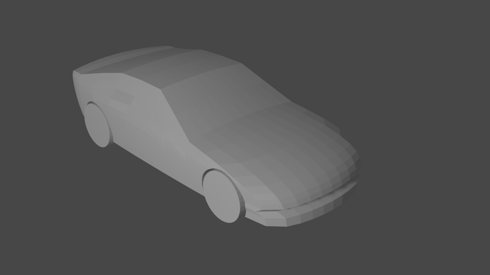

# Car Generation
CarGen is a blender Add-On which creates a car mesh.
This Add-On is for blender 2.8+.

### Installation
Download the .zip file, install it and enable it like any blender add-on.  
The add-on will be present in the sidebar in Object Mode (press 'N' to enable the sidebar).

### Usage
It is possible to load preselected parameters. Now, 3 cars are available : Corvette C6, Ford Mustang Fastback 1969, Ferrari F430. I may add other cars later.

It is also possible to enter every parameter by hand.  

The available dimensions are : 
*  Basic dimensions :
	* Length
	* Width
	* Height
* Wheels related dimensions :
	* wheelbase
	* distance from the front of the car the the center on the front wheelbase
	* wheel + tire radius
	* wheel width
	* percentage of the wheel under the car floor
* Specific dimensions from the front to the rear of the car
	* grille height
	* hood angle 
	* hood length
	* windshield angle
	* roof length
	* roof angle
	* rear window angle
	* rear window height
	* trunk angle

The Add-On was thought of with lengths in meters and angles in degres.
All angles are mesured from the horizontal.

Then, it is possible to add curves to the boxy shape to make it look like a real car.
It is possible to put curves on :
* grille
* hood
* roof
* trunk
* rear
* side
* under the car

Those curves only act on one axis. For example, a curve on the hood will only modify the z position of the vertices.

Example here with curves added from the boxy car above.

There is a parameter to control the size of the mesh. The time it takes to create the car is heavily dependant of this parameter. With curves the result is also really different with a smaller mesh.  
Below is the same car with a much bigger mesh size.

The creation time goes from 0.2s with the bigger mesh size to 10s with the smallest mesh size.    

The curves are sized to be taken from -1 to +1 and are automatically adjusted to the car size.  
All native python and numpy functions are supported, the only restriction is that the formula of the curve needs to be in one line.

### Warnings
Delete or rename all objects named 'Cube' or 'Cylinder' before creating a car. Otherwise, it may behave oddly.
